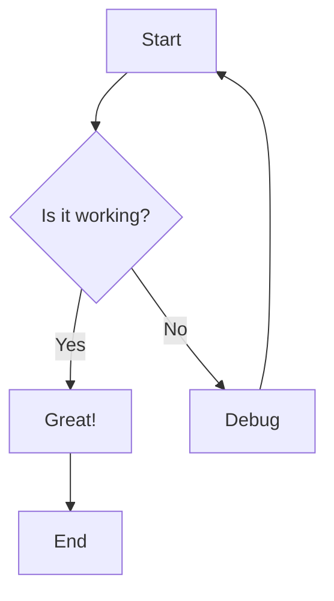
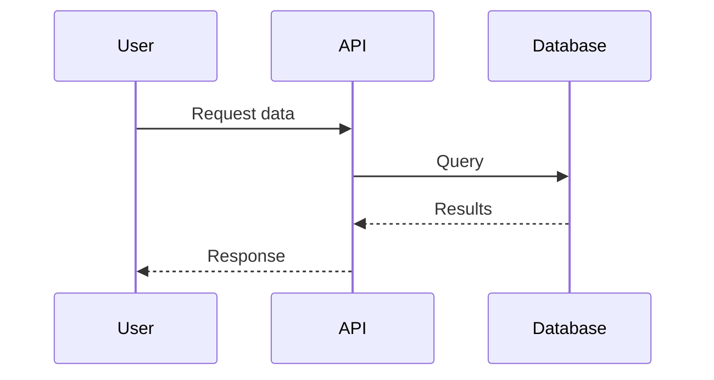
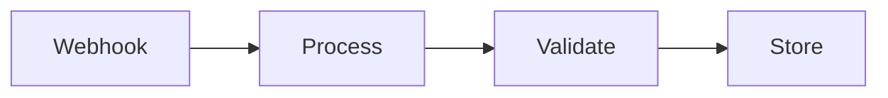

# Markdown Test Fixture

This fixture tests all markdown features for file view mode.

## Headings Work

### Third Level
#### Fourth Level

## Text Formatting

This is **bold text** and this is *italic text*. You can also use ~~strikethrough~~.

## Lists

### Unordered List
- Item 1
- Item 2
  - Nested item
- Item 3

### Ordered List
1. First item
2. Second item
3. Third item

## Links and Images

[External link](https://example.com)


## Node Mentions

Check out this workflow [node:fetch-data](node:fetch-data) and also [send-email](node:send-email-abc123).

## Code Blocks

### Inline Code
Here is some `inline code` within text.

### Fenced Code Block with Language
```typescript
function greet(name: string): string {
  return `Hello, ${name}!`;
}
```

### Fenced Code Block without Language
```
Plain text code block
No syntax highlighting
```

### Python Code
```python
def calculate_sum(a, b):
    return a + b

result = calculate_sum(5, 10)
print(f"Result: {result}")
```

## Mermaid Diagrams

### Valid Mermaid Diagram


### Another Valid Diagram


## Tables

| Feature | Status | Priority |
|---------|--------|----------|
| Mermaid | ✅ Done | High |
| Node chips | ✅ Done | High |
| Tables | ✅ Done | Medium |
| Code highlight | ⏳ WIP | Medium |

## Blockquotes

> This is a blockquote.
> It can span multiple lines.
> 
> And contain multiple paragraphs.

## Task Lists

- [x] Implement Mermaid support
- [x] Add node mention chips
- [ ] Add syntax highlighting
- [ ] Write tests

## Horizontal Rule

---

## Complex Example

Here's a complex workflow that combines multiple features:

1. Start with [trigger node](node:webhook-trigger-xyz789)
2. Process data using this code:

```javascript
const processData = (input) => {
  return input.map(item => ({
    ...item,
    processed: true
  }));
};
```

3. Review the flow in this diagram:



4. Finally, check the **results table**:

| Step | Duration | Status |
|------|----------|--------|
| Receive | 10ms | ✅ |
| Process | 45ms | ✅ |
| Store | 23ms | ✅ |
